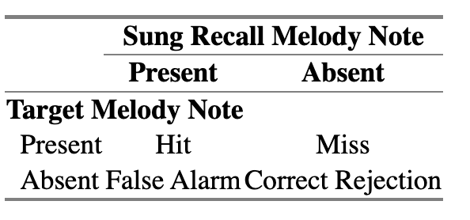

```{r}


# https://stackoverflow.com/questions/19918985/r-plot-only-text

plot_text <- function(txt) {
  # Didn't get this to work
  par(mar = c(0,0,0,0))

  plot(c(4, 0), c(0, -10), ann = F, bty = 'n', type = 'n', xaxt = 'n', yaxt = 'n', main = txt)

  # text(x = 0.1, y = 0, txt, cex = 1.6, col = "black", adj = 1)
  

  #par(mar = c(5, 4, 4, 2) + 0.1) # Restore default pars
}


sim_vs_acc <- function(target, recall, 
                       target_rhythms = rep(0.5, length(target)), 
                       recall_rhythms = rep(0.5, length(recall)),
                       example_no,
                       example_description) {
  
  h <- musicassessr::score_melodic_production(
    user_melody_input = recall,
    user_duration_input = recall_rhythms,
    user_onset_input = c(0, cumsum(recall_rhythms)[1:(length(recall_rhythms)-1)]),
    stimuli = target,
    stimuli_durations = target_rhythms,
  )
  
  
  tibble::tibble(
    `Example No.` = example_no,
    `Example Desc.` = example_description,
    `Acc.` = h$accuracy,
    #Prec. = h$precision,
    #Recall = h$recall,
    F1 = h$F1_score,
    #PMI = h$PMI,
    AccAdj= h$proportion_of_correct_note_events_controlled_by_stimuli_length_log_normal,
    #proportion_of_correct_note_events = h$proportion_of_correct_note_events,
    #proportion_of_stimuli_notes_found = h$proportion_of_stimuli_notes_found,
    opti3 = h$opti3,
    ngrukkon = h$ngrukkon,
    rhythfuzz = h$rhythfuzz,
    harmcore = h$harmcore
  ) %>% dplyr::mutate(dplyr::across(`Acc.`:harmcore, round, 2))
}

```


```{r}

create_sheet <- function(target_v, 
                         recall_v, 
                         target_rhythms_v = rep("quarter", length(target_v)),
                         recall_rhythms_v = rep("quarter", length(recall_v)),
                         key = NULL,
                         target_title = "Target",
                         recall_title = "Recall"
                         ) {
  l <- Line(
  pitches = as.list(target_v),
  durations = as.list(target_rhythms_v),
  name = target_title
  )
  
  l2 <- Line(
  pitches = as.list(recall_v),
  durations = as.list(recall_rhythms_v),
  name = recall_title
  )
  
  
  if(!is.null(key)) {
    m <- Music() + Meter(4, 4)+ Key(key) + l + l2
  } else {
    m <- Music() + Meter(4, 4) + l + l2
  }
  
  
  show(m) 
}

invert_melody <- function(m) {
  start_note <- m[1]
  intervals <- diff(m)
  inverted_intervals <- intervals * -1
  itembankr::rel_to_abs_mel(inverted_intervals, start_note)
}

```


The aim is of Experiment 1 is to succinctly explore the difference between accuracy vs. similarity measures. We explore how they diverge in a quantitative manner when applied to assessing how well a sung recall matches a target melody. We first operationalise them both verbally and mathematically, also giving some reference to real musical examples. Subsequently, we proceed with a simulation study using the stimuli set that we use with real participants in Experiment 2, to evaluate how their properties change as a function of various experimental manipulations.


# Operationalising Accuracy vs. Similarity


## What is accuracy?

Traditionally, melodic recall data has been scored with accuracy measures [@slobodaImmediateRecallMelodies1985]. In the context of melodic recall, broadly speaking, accuracy can be defined as the number of correct notes relative to something else. That something else could be i) the number of unique notes in the target stimulus or ii) the number of recalled notes. Let us call a note that is both contained in the target melody and the sung recall a "hit", a note recalled that is not in the target stimulus, a "false alarm" and a note in the target melody but not the sung recall, a "miss". 


```{r, include = FALSE}

tibble::tibble() %>% 
  knitr::kable(caption = "Confusion matrix for note-by-note comparison of target melody to sung recall.")

```


```{r, include = FALSE}

# matrix(c("Hit", "False Alarm", "Miss", "Correct Rejection"),
#        ncol = 2,
#        dimnames = list(`Target Melody Note` = c("Present", "Absent"),
#                        `Sung Recall Melody Note` = c("Present", "Absent"))) %>% 
#   htmlTable::htmlTable()


  
```


*Accuracy* can be defined as:

\begin{equation}
Accuracy = \frac{NoHits}{NoHits + NoFalseAlarms + NoMisses}
(\#eq:accuracy)
\end{equation}

Another measure related to accuracy is *precision*, defined as:

<!-- tp / tp + fp -->

\begin{equation}
Precision = \frac{NoHits}{NoHits + NoMiss}
(\#eq:precision)
\end{equation}


which means the denominator will be the number of notes in the stimulus and is, hence, the proportion of notes in the target stimulus recalled. This is the measure that @slobodaImmediateRecallMelodies1985 utilised on sung recall data.

Lastly, *recall* is defined as:


<!-- tp / tp + fn -->

\begin{equation}
Recall = \frac{NoHits}{NoHits + NoFalseAlarms}
(\#eq:recall)
\end{equation}

where the denominator represents the number of notes in the sung recall.

Precision and recall can be combined together into a score known as the F~1~ score, which is the harmonic mean of precision and recall, simplifying to: 

\begin{equation}
F_1 = \frac{2 * NoHits}{2 * NoHits + NoMisses + NoFalseAlarms}
(\#eq:f1score)
\end{equation}

The F~1~ score as well as precision and recall have been used extensively in computational contexts and music information retrieval contexts [@pearceMelodicGroupingMusic2010]. One issue in melodic recall research is that the length of a recall can be substantially different from that of a target melody length, in terms of number of notes. One way of dealing with this, in the context of accuracy, is to normalise based on the length of the stimuli:


\begin{equation}
AccuracyAdjusted = Accuracy * LogNormal(\frac{NoNotesInSungRecall}{NoNotesInStimuli}) \quad \in [0,1]
(\#eq:accuracyadjusted)
\end{equation}

where `Accuracy` is computed via Eq. 1 and `LogNormal` represents a log normal transformation function to map the accuracy value into the closed unit interval range.

We profile these measures of accuracy, *Accuracy*, *Recall*, *Precision*, *AccuracyAdjusted* and *F~1~*, in Experiment 1.


## Methodological Advance for Melodic Recall Research

However, as highlighted by @sturmClassificationAccuracyNot2013's paper title, "classification accuracy is not enough" when it comes to assessing musical information. As argued there, this is because accuracy measures do not work at a high enough level to meaningfully represent musical structures. In our case - melodic recall - note-by-note accuracy measures fail to capture important aspects of musical structure, such as interval patterns and the specific order of notes. In this way, accuracy is not particularly meaningful in a musical context, and we suggest is an inadequate measure of sung recall. 

This can be viewed as a limitation of previous melodic recall research. The approach taken by @slobodaImmediateRecallMelodies1985 and others were construed from reasonable musicological considerations, but do not represent the only way to compare two melodic objects. Moreover, such comparisons have not been tested for their ecological validity. As noted, @slobodaImmediateRecallMelodies1985 used the *precision* measure of accuracy. However, measuring note-by-note reproduction accuracy hardly reflects the fact that the original and recall may differ in many improvised notes, but that on other levels of human melodic understanding the sung rendition might be "highly related to the original in many respects" (Sloboda & Parker, 1985, p. 159). Thus, Sloboda and Parker recognised in 1985: "there is no theory of melodic identity".


### Melodic Similarity

To overcome this issue, we introduce the notion of a melodic similarity metric as being more appropriate for scoring melodic recall data. In essence, measures of melodic similarity embody important notions of melodic identity into them. The concept of similarity is hence more sophisticated than simple note-by-note accuracy measures and capture more musical variance. In the scientific area that has been termed *Music Information Retrieval* [@downieMusicInformationRetrieval2003], and that has seen a large boost in recent years, several approaches to *similarity* measurement for melodies and other musical objects have been developed [e.g., @mullensiefenCognitiveAdequacyMeasurement2004; @pearceMullensiiefen2017; @typkeTransportationDistancesHuman2007; @yuanPerceptualVsAutomated2020]. The similarity measures employed here are favoured because they proved their effectiveness and ecological validity (or rather comparability) with the notion of melodic similarity of musically experienced participants in separate studies [@mullensiefenCourtDecisionsMusic2009; @mullensiefenMelodicSimilarityApproaches2004; @mullensiefenModellingExpertsNotions2007]. Therefore, while there still might not be an undisputed theory of melodic identity, as Sloboda and Parker claimed in 1985, this study will use at least some algorithms that came quite close in emulating musically experienced participants' similarity judgements.


Having obtained numerical representations of both the sung recalls and the target melodies, the similarities between a target melody and sung recall of that melody, for each attempt of each participant, can be calculated using the algorithmic similarity measures described in @mullensiefenMelodicSimilarityApproaches2004. The similarity measures we employed complied with two main points already raised by @slobodaImmediateRecallMelodies1985 in the discussion of their methodology of melodic comparison: in most cases - that is especially true for the earlier trials - participants only recall a smaller part of the original melody, which may not even start with the beginning of the original. Thus, a similarity measure (or algorithm) must be chosen that automatically looks for the best alignment of the (short) melodic sequence of the sung recall with the original melodic sequence. An algorithm for the optimal alignment of two symbol sequences that has been widely used in domains such as text retrieval or bio-computing, as well as music information retrieval, is the so-called Edit Distance or Levenshtein distance [e.g., @mongeauComparisonMusicalSequences1990]. The Edit Distance is the minimum number of operations it takes to transform one symbol string into another: the possible operations being insertion, deletion, and substitution.
The actual calculation of the Edit Distance is carried out using dynamic programming and is not explained here. For a general reference regarding the algorithm see e.g., @gusfieldAlgorithmsStringsTrees1997. In this case, the maximal Edit Distance of two strings is equal to the length of the longer string. To convert the Edit Distance into a similarity measure with a range of values $[0,1]$ we use the following:

\begin{equation}
\sigma(s,t)=1-\frac{d_e (s,t)}{\max(|s|,|t|)}
(\#eq:editdist)
\end{equation}

where $|s|$ and $|t|$ denote the element counts of strings $s$ and $t$ respectively, and $d_e(s,t)$ stands for the Edit Distance between strings $s$ and $t$. 


Just like the manual scoring techniques employed by @slobodaImmediateRecallMelodies1985, the edit distance calculates the similarity between two symbolic sequences by taking the number of edits (i.e. additions, deletions or substitutions) that are necessary to transform one of the sequences into the other, and dividing this figure by the number of symbols in the longer sequence. It thus could be argued that Sloboda and Parker intuitively used a version of the edit distance, evaluating the similarity between the recalls of their participants on the original melody, keeping the order of notes in mind.

However, instead of applying edit distance to raw note values, here the edit distance is computed on various symbolic representations of musical dimensions [i.e., relative pitch sequences - intervals - as opposed to single pitches; rhythm sequences; and sequences of implied harmonies; @mullensiefenMelodicSimilarityApproaches2004]. Specifically, we employ the *opti3* measure of melodic similarity [@mullensiefenMelodicSimilarityApproaches2004] as our main dependent variable. *opti3* is a hybrid measure derived from the weighted sum of three individual measures which represent different aspects of melodic similarity. The similarity in interval content is captured by the *ngrukkon* measure is based on the Ukkonen Measure that measures the difference of the occurrence frequencies of interval trigrams ($\tau$) contained within the target melody ($f_s (\tau)$) and the comparison melody ($f_s (\tau)$) (see @uitdenbogerdMusicInformationRetrieval2002. Formally:


\begin{equation}
u(s,t)=\sum_{\tau \in s_n \cup t_n} |f_s (\tau)-f_t(\tau)|
(\#eq:ngrukkon)
\end{equation}

As the Ukkonen Measure is a distance measure in its original definition, we normalise by the maximum possible number of $n$-grams and subtract the result from 1:

\begin{equation}
\sigma (s,t) = 1 - \frac{u(s,t)}{|s|+|t|-2(n-1)}
(\#eq:ngrukkon2)
\end{equation}

Note that the Ukkonen measure is not based on the edit distance but still takes order of notes into account at a local level by comparing trigrams.

Harmonic similarity is measured by the *harmcore* measure. This measure is based on the chords implied by a melodic sequence, taking pitches and durations into account. Implied harmonies are computed using the Krumhansl-Schmuckler algorithm [@krumhanslCognitiveFoundationsMusical1990] and the harmonic sequences of the two melodies are compared by computing the number of operations necessary to transform one harmonic sequence into the other sequence via the edit distance. Finally, likewise, rhythmic similarity is computed by first categorizing the durations of the notes of both melodies (known as "fuzzification") and then applying the edit distance to measure the distance between the two sequences of categorised durations. The resulting measure of rhythmic similarity is called *rhythfuzz* [@mullensiefenMelodicSimilarityApproaches2004]. Note that *rhythfuzz* does not take metric information into account and works solely on the basis of (relative) note durations. Similarly, *ngrukkon* works with interval information and is hence invariant to transposition. 

Based on the perceptual data collected by @mullensiefenMelodicSimilarityApproaches2004, the three individual measures are weighted and combined to form a single aggregate measure of melodic similarity, *opti3*. Hence, *opti3* is sensitive to similarities and differences in three important aspects of melodic perception (pitch intervals, harmony, rhythm). We note that all three individual measures (*ngrukkon*, *harmcore*, *rhythfuzz*) can take values between 0 (= no similarity) and 1 (= identity) and are length-normalized by considering the number of elements of the longer melody. *opti3* then comprises [@mullensiefenMelodicSimilarityApproaches2004]:

\begin{equation}
{opti3}= 0.505 \cdot \mathtt{ngrukkon} + 0.417 \cdot \mathtt{rhythfuzz} + 0.24 \cdot \mathtt{harmcore} -0.146
(\#eq:opti3)
\end{equation}

Note that we here present the normalised weights, which constrain the values to be [0,1]. We note that *opti3* is dependent on the length of the two comparison melodies in only a soft sense, which is particularly relevant to Experiment 2 of this paper, where we use the number of recalled notes as an auxiliary dependent variable. If one melody is shorter than the other, at least some of the melodic identity is destroyed: necessarily, the rhythmic (*rhythfuzz*) and intervallic (*ngrukkon*) components, but not necessarily the harmonic (*harmcore*) component. It should hopefully be clear that *opti3* captures far more (musical) information than melody length(s) alone and/or accuracy-style measures. The ecological validity of the aggregate similarity measure has been established in several perceptual experiments [@mullensiefenCourtDecisionsMusic2009; @yuanPerceptualVsAutomated2020]. See Appendix A to compare the similarity measures and Appendix B for notated examples of development in sung recall performance and a qualitative description of their change in similarity.


### What is the difference between accuracy and similarity measurements?

As should hopefully be clear, similarity measures pay more attention to musical features that arise from the relationships between pitch and rhythmic values. They could be considered more global in nature. Conversely, note-by-note accuracy measures only pay attention to the very local level of notes, which does not respect the emergent properties of musical features. Consequently, similarity has a more perceptual quality. In this way, similarity algorithms have been used to predict subjective similarity judgements, for example, in musical plagiarism court cases, with excellent success [@yuanPerceptualVsAutomated2020; @mullensiefenCourtDecisionsMusic2009]. 

We now score some simple examples to demonstrate the difference between accuracy and similarity (see Table 1 and Figure 1). Let us take the first five notes of the C major scale as our target. If the target and recall are the same, all measures of accuracy and similarity will be 1. However, as Example 1 shows, if the pitch order is reversed, the accuracy measures will be 1, but the overall measure of similarity (*opti3*), nearly half this. This corresponds to the fact that the notes are the same, but the order highly distorts the melodic identity (note that the harmonic and rhythmic identity is preserved, however). Conversely, as Example #2 shows, transposing the recall by a semitone causes a large deterioration in the accuracy scores, since nearly all notes are different, but the similarity measure is 1, corresponding to the fact that the melodic identity is preserved under the principle of transposition invariance. For Examples 3-6, we take the humourous example of the "The Lick" - the archetypal jazz pattern made famous by YouTube^[https://www.youtube.com/watch?v=krDxhnaKD7Q] and transform it by the familiar melodic transformations of retrograde, inversion and retrograde inversion. Example #3 shows that the retrograde preserves accuracy but destroys identity and similarity. Examples #4 and #5 show that the inversion and retrograde inversion somewhat preserves accuracy but destroys identity and similarity. Finally, consider no pitch value changes, but only rhythmic changes, which destroys rhythmic identity and lowers overall melodic similarity (*opti3*), but preserves accuracy.

\newpage


```{r}


# Example #1: Reversed Recall

ex1_t <- c(60, 62, 64, 65, 67)
ex1_r <- ex1_t[length(ex1_t):1]

ex1_rhythms <- c(0.25, 0.25, 0.25, 0.25, 0.5)
ex1_rhythms_text <- c("quarter","quarter", "quarter", "quarter", "half")


# Example #2: Transposed Recall
ex2_t <- ex1_t
ex2_r <- ex1_t + 1


# The Lick

the_lick <- c(67, 69, 70, 72, 69, 65, 67)
the_lick_rhythms <- c(0.25, 0.25, 0.25, 0.25, 0.5, 0.5, 1)
the_lick_rhythms_text <- c("eighth","eighth", "eighth", "eighth", "quarter", "quarter", "half")


# Example #3: The Lick plus its retrograde (rhythms the same

the_lick_retrograde <- the_lick[length(the_lick):1]


# Example #4: The Lick plus its inversion (rhythms the same)

the_lick_inverted <- invert_melody(the_lick)

# "Example #5: The Lick plus its retrograde inversion (rhythms the same)

the_lick_retrograde_inversion <- the_lick_inverted[length(the_lick_inverted):1]


# Example #6: The Lick plus its rhythm values changed.

the_lick_rhythms_diff <- c(0.5, 0.5, 0.5, 0.5, 0.25, 0.25, 0.5)
the_lick_rhythms_text_diff <- c("quarter","quarter", "quarter", "quarter", "eighth", "eighth", "quarter")


s1 <- create_sheet(ex1_t, ex1_r, ex1_rhythms_text, ex1_rhythms_text,
                   target_title = "Ex.1 Target", recall_title = "Ex.1 Recall")

s2 <- create_sheet(ex2_t, ex2_r, ex1_rhythms_text, ex1_rhythms_text,
                   target_title = "Ex.2 Target", recall_title = "Ex.2 Recall")

s3 <- create_sheet(the_lick, the_lick_retrograde, the_lick_rhythms_text, the_lick_rhythms_text, key = -1, 
                   target_title = "Ex.3 Target", recall_title = "Ex.3 Recall")

s4 <- create_sheet(the_lick, the_lick_inverted, the_lick_rhythms_text, the_lick_rhythms_text, key = -1, 
                   target_title = "Ex.4 Target", recall_title = "Ex.4 Recall")

s5 <- create_sheet(the_lick, the_lick_retrograde_inversion, the_lick_rhythms_text, the_lick_rhythms_text, key = -1, 
                   target_title = "Ex.5 Target", recall_title = "Ex.5 Recall")

s6 <- create_sheet(the_lick, the_lick, the_lick_rhythms_text, the_lick_rhythms_text_diff, key = -1,
                   target_title = "Ex.6 Target", recall_title = "Ex.6 Recall")

```


```{r}

s1

```

```{r}

s2

```


```{r}

s3

```


```{r}
s4

```


```{r}

s5

```

```{r, fig.cap = "Notation of sung recall comparison examples"}

s6

```


\newpage

```{r, warning = FALSE}


main_tb <- rbind(
  sim_vs_acc(target = ex1_t, recall = ex1_r, example_no = 1, example_description = "Reversed Recall", 
             target_rhythms = ex1_rhythms, recall_rhythms = ex1_rhythms),
  sim_vs_acc(target = ex2_t, recall = ex2_r, example_no = 2, example_description = "Transposed Recall", 
             target_rhythms = ex1_rhythms, recall_rhythms = ex1_rhythms),
  sim_vs_acc(
  target =  the_lick,
  target_rhythms = the_lick_rhythms,
  recall = the_lick_retrograde,
  recall_rhythms = the_lick_rhythms,
  example_no = 3,
  example_description = "The Lick vs. its retrograde (rhythms the same)"),
  
  sim_vs_acc(
    target =  the_lick,
    target_rhythms = the_lick_rhythms,
    recall = the_lick_inverted,
    recall_rhythms = the_lick_rhythms,
    example_no = 4,
    example_description = "The Lick plus its inversion (rhythms the same)"),
  
  sim_vs_acc(
    target =  the_lick,
    target_rhythms = the_lick_rhythms,
    recall = the_lick_retrograde_inversion,
    recall_rhythms = the_lick_rhythms,
    example_no = 5,
    example_description = "The Lick plus its retrograde inversion (rhythms the same)"
  ),
  
  
  sim_vs_acc(
    target =  the_lick,
    target_rhythms = the_lick_rhythms,
    recall = the_lick,
    recall_rhythms = the_lick_rhythms_diff,
    example_no = 6,
    example_description = "The Lick plus its rhythm values changed."
  )


)
  
main_tb %>% knitr::kable(caption = "Examples of two comparison melodies scored for their level of similarity.")

```


The examples should intuitively demonstrate how accuracy and similarity measures diverge and specifically, that similarity metrics embody notions of perceptual similarity across relevant musical dimensions, as opposed to note-by-note accuracy measures, which do not necessarily embody anything musical into their consideration. In other words: accuracy measures may score a target and its recall very highly, despite the musical differences being very large, and the opposite, a very musically similar target and recall very badly! These observations are not new. Perceptual experiments have demonstrated that the familiar transformations of retrograde, inversion and retrograde inversion destroy melodic identity [e.g., @dowlingRecognitionMelodicTransformations1972]. However, we are not aware of such a distinction being made clearly within melodic recall research. To profile the difference more quantitatively, we now run a series of short simulation studies.

# Method

The method taken here is to start with the stimuli set of melodies that we use with real participants in Experiment 2. Starting with this set, we transform the melodies in various ways so that they become more or less like their originals. We then compare how melodies vary on accuracy and similarity scores as a function of the number of transformations.

## Materials

14 pop songs were used as the basis for the experimental material. Two different melodies were taken from each song to form a stimuli set of 28 melodies in total (9–21 seconds; length = 15-48 notes; see Appendix C). Melodies were selected to represent a wide range of Western popular music styles, ranging from easy listening ballads and Schlager via mainstream pop, rock, and disco to blues, R'n'B and hip hop. They were taken from hit song collections covering repertoire form the 1960s to 2000, but overly popular or well-known songs were avoided. The set of melodies was selected to provide a large range of stylistic features within the context of Western popular music. This includes different melodic and singing styles as well rhythms and meters that are idiomatic for certain genre. This wide stylistic breadth should allow for a better generalisation across Western popular music than a more homogeneous stimulus set that exclude certain musical features deliberately.


## Simulation Experiments

We conducted a series of eight simulation experiment using the stimuli described above. In each experiment, we manipulated each stimulus via transformations either on the raw pitch classes or the duration values. Subsequently, all results were aggregated across melodies. We describe each sub-experiment succinctly in Table 2 below. For more detailed information, please consult our experiment code and data (i.e., simulated melodies)^[https://github.com/sebsilas/Melodic_Recall_Paper_2023].

\newpage

```{r}

tibble::tibble(`No.` = paste0("1", LETTERS[1:8]),
               Name = c("Rhythmic jitter", "Pitch insertions", "Pitch deletions", "Pitch substitutions", "Combined pitch insertions, deletions, and substitutions", "Combined pitch insertions, deletions, and substitutions and rhythmic jitter", "Length mismatch", "Scramble"),
          
               Description = c("Duration values were jittered by various amounts (0, 0.01, 0.10, 1, 2, 5), using the `jitter` *R* function. This corresponds to singing the rhythms but not pitches incorrectly.",
                               
          "Various number of notes were randomly inserted, corresponding to cases where human participants mistakenly add random notes to their sung recalls.",
          
          "Notes were randomly deleted, corresponding to cases where human participants mistakenly miss notes in their sung recalls.",
          
          "Notes were randomly substituted (at any location in the melody), corresponding to cases where human participants sing some random notes wrong in their sung recalls.",
          
          'The last three experiments combined, corresponding to human participants making various random mistakes.',
          
          'Rhythmic jitter and pitch transformations as described above (i.e., experiments 1A and 1E) were transformed simultaneously, corresponding to singing pitches and rhythms wrong.',
          
          'Notes were removed from the end of the target melody to create a length mismatch between target and recall, corresponding to a participant not yet being able to sing an entire melody back.',
          
          'Different sized chunks of the melody were scrambled, such that the same notes were in each chunk, but the order of notes was changed randomly. This corresponds to human participants retaining a gist of the melodic identity, but not a precise representation of its structure.'
                               
                               )
               ) %>% 
  knitr::kable(caption = "Description of experiments simulating human errors on a sung recall task")


```

# Data Analysis

First, we assess the descriptive statistics for the variables and, in particular, we compared the coefficient of variation (*CV*) between our measures. The *CV* is not the same as the well-known coefficient of determination (R^2^). Instead, the *CV* is the standard deviation (SD) of a measure divided by its mean. The *CV* is preferred over the standard deviation for comparing variance across measures, because the *CV* is a dimensionless number, and hence, facilitates comparison of the SD across different datasets or measures, with different means. By comparing the *CV* across measures, we can assess whether some capture more variance than others.

Next, we inspect each sub-experiment results via graphs, where the y-axis always represents the score on each accuracy or similarity measure and the x-axis represents a function of transformations. The specific transformations are operationalised in Table 2.

Finally, we formally model all experimental data simultaneously. The dependent variable is the (accuracy or similarity) score; Measure (*accuracy*, *opti3* etc.) and Experiment (1A-IH) are categorical predictors; length of sung recall is a numeric predictor as well as the interactions between i) Measure and length of sung recall and ii) Measure and Experiment were included as predictors. There were 35,371 observations. To facilitate interpretation of the model parameters, sung recall length was standardised before model fitting (note the other parameters are already [0, 1]). 

```{r}

lm1 <- gensim::all_exps %>% 
  dplyr::filter(!Measure %in% "pmi") %>% 
  mutate(sung_recall_length = scales::rescale(sung_recall_length))  %>% 
  lm(value ~ Measure + experiment + sung_recall_length + Measure:sung_recall_length + Measure:experiment, data = .)

# Doesn't render in Word:
# eq_form <- equatiomatic::extract_eq(lm1)

```


# Results

Table 3 presents descriptive statistics. The similarity measures have the highest coefficient of variation compared to the accuracy measures, suggesting that they capture more variance than accuracy measures, at least in the context of our experiment. This is also suggested by the graphs in Figure 2, whereby similarity measures tend to degrade more than accuracy measures, as a function of the musical errors we simulated. The other results shown in Figure 2 can be summarised as follows: 1A) adding jitter to duration values causes *rhythfuzz* to degrade as well as *harmcore* (because it offsets the alignment of harmonic sequences), and consequently, *opti3*. All accuracy measures are unaffected. 1B) note insertions cause all measures to degrade, except accuracy and precision, which stay constant. Similarity measures generally degrade more prominently than accuracy-style measures, particularly *ngrukkon*; 1C) note deletions cause all measures to degrade, except *accuracy* and *recall*, which stay constant. Similarity measures generally degrade more quickly than accuacy-style measures, particularly *ngrukkon*; 1D) note deletions cause all measures degrade, except *rhythfuzz*, whichs stay constant. The other similarity measures (*ngrukkon*, *harmcore*, *opti3*) degrade more prominently than accuracy-style measures, particularly *ngrukkon*. 1E) combined pitch transformations (insertions, deletions and substitutions) cause all measures to degrade, but similarity measures more prominently than accuracy-style measures; 1F) combined pitch transformations (insertions, deletions and substitutions) and rhythmic jitter cause all measures to degrade, but similarity measures more prominently than accuracy-style measures; 1G) as the length of the recall increases towards the length of the target melody, all measures increase, except recall and accuracy, which are always 1; 1H) Scrambling the order of pitches affects no accuracy measures or *rhythfuzz*. All other similarity measures deteriorate as a function of scrambling. 

\newpage

```{r}

gensim::all_exps %>% 
  dplyr::filter(!Measure %in% "pmi") %>% 
  dplyr::group_by(Measure) %>% 
  dplyr::summarise(
    mean = mean(value, na.rm = TRUE),
            sd = sd(value, na.rm = TRUE),
            coef_variation = sd/mean,
            ) %>% 
  ungroup() %>% 
  dplyr::arrange(dplyr::desc(coef_variation)) %>% 
  dplyr::mutate(dplyr::across(mean:coef_variation, round, 2)) %>% 
  dplyr::rename(Mean = mean, SD = sd, `Coefficient of Variation` = coef_variation) %>% 
  knitr::kable(caption = "Descriptive statistics for all simulation experiment results, ordered by the coefficient of variation.")

```

\newpage

```{r, fig.cap = "Simulation experiment results for accuracy vs. similarity measures."}

knitr::include_graphics('dat/aux/similarity_accuracy_simulations.pdf')

```


Table 4 shows the general linear regression model results. All similarity measures tend to have lower scores, as represented by all negative beta coefficients ($\beta = -0.44 to \beta =-0.20$). Accuracy measures have higher beta coefficients. This corresponds to our descriptive results, whereby accuracy measures were less likely to be affected by transformations (simulated human errors) because they do not respect note orders, for example, so tend to score more highly. The experiment/transformation type differentially affects the accuracy similarity scores, as represented by nearly all significant p-values (*p* < .001), suggesting that different measures are more sensitive to some transformations than others. The transformation associated with overall lowest scores was substitutions ($\beta = -.14$) and highest scores are rhythmic transformations $\beta{RhythmicJitter} = 0.23$. Sung recall length is generally associated with a higher score ($\beta = 0.20$) (i.e., scores tend to be higher if a recall is closer to its target in length). *accuracy_adjusted*, *ngrukkon*, *precision* and *recall*  have a significant interaction with sung recall length, but F~1~ score, *harmcore*, *opti3* and *rhythfuzz* do not. The model had a R^2^ value of `r round(summary(lm1)$r.squared, 2)` (adjusted = `r round(summary(lm1)$adj.r.squared, 2)`).

\newpage

```{r}

apa_lm1 <- apa_print(lm1)
apa_lm1_tb <- apa_lm1$table
apa_lm1_tb_filt <- apa_lm1_tb %>% dplyr::filter(!grepl("times", term))


apa_table(apa_lm1_tb_filt,
          caption = "Regression model regressing score onto measure, sung recall length and experiment, plus interactions (interactions not displayed).") 


```


# Discussion

Our simulation studies generally show that accuracy and similarity measures produce different assessments of musical behaviour, such as sung recall. This is not surprising, since similarity measures make comparisons on higher-order musical features. As our examples showed intuitively, accuracy measures are not ideal for assessing musical behaviour. This is because they do not have notions of melodic identity embodied in them. Conversely, melodic similarity measures explicitly embody important musical dimensions, and make comparisons on such dimensions. The particular dimensions used by our main dependent variable, *opti3* are based on human similarity judgements [e.g., @mullensiefenModellingExpertsNotions2007], giving them ecological validity - a property that accuracy measures do not have in the context of sung recall. Additionally, as demonstrated, melodic similarity, as derived here, captures more variance as a function of various simulated musical errors, which is an additional useful property. This is because accuracy measures do not capture some forms of musical errors, like singing notes in the wrong order. Conversely, this would affect measures like *ngrukkon*, which assesses interval sequences, but not *harmcore*, which captures overall harmony. In other words, different domains are measured simultaneously by *opti3*. Since someone can be musically more or less accurate in different respects, the measure may be both punitive or benovelent on each dimension, but it respects the fact that musical ability is multidimensional: one may sing a rhythm wrong, but the notes right; the harmony wrong but the rhythms correct. For these reasons, we proceed with Experiment 2 using *opti3* as our main dependent variable to measure overall melodic (sung) recall performance.


