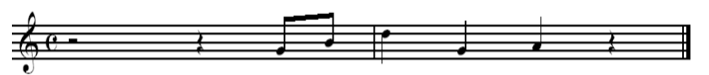

# Appendix A

## Dependent variables: Our main similarity variables of interest are highlighted in orange.


```{r tab.cap = NULL}

# TODO: Add other DVs from Exp. 1

appendix_b_tab <- tibble::tibble(
  Measure = c("ngrukkon", "harmcore", "rhythfuzz", "opti3", "No. Recalled Notes", "No. Correct", "No. Errors"),
  Definition = c("Ukkonen measures for n-grams on raw pitch values",
                 "Edit Distance of harmonic symbols per segment, obtained via Krumhansl’s tonality vectors.",
                 "Edit distance of classified length of melody tones.", "3.027 * ngrukkon + 2.502 * rhythfuzz + 1.439 * harmcore  - 0.146", "The number of notes the participant produced in the trial.", "The number of correct notes the participant sang (allowing octave errors).", "The number of errors participants sang (allowing octave errors)."))

ft <- qflextable(appendix_b_tab)

ft <- bg(ft, i = 1:4, bg = "orange", part = "body")

# ft <- set_caption(ft, caption = "Full set of dependent variables. Our main similarity variables of interest are highlighted in orange.")


set_table_properties(ft, layout = "autofit")


```


\newpage


# Appendix B

## Examples showing development of trial performance and a qualitative description of their change in similarity.

To illustrate the similarity measurement for different musical dimensions, the following figures show a typical improvement of the sung recalls of one participant of a particular test item. Due to space limitations, only the transcriptions of two trials can be depicted here.

Participant *F.S.* (male, aged 29, plays bass in rock band) listened to an audio excerpt from the pop song "Cold, Cold Heart" by *Wet Wet Wet*, the vocal melody of which is depicted in Figure 9. Despite the fact that it contains a large jump of one and a half octaves, participants found this melody generally rather easy to reproduce from memory, probably due to its clear phrase structure. Figure 10 shows the recall of *F.S*. after the third listening. The rendition resembles most to the third (and last) phrase of the original melody. Figure 11 depicts the rendition on the sixth and last trial. A great improvement in accuracy is clearly visible, although he altered all B flats to B naturals. When reflected by similarity algorithms, this will generally show an increasing score in overall similarity  per trial, though perhaps differing by specific dimension, depending on the type of error made in a particular attempt.


```{r fig.cap = "Transcription of original melody from chorus of “Cold Cold Heart” by Wet Wet Wet" }

```

```{r fig.cap = "Transcription of F.S.’s sung recall of the test item on  the third trial" }

```

```{r fig.cap = "Transcription of F.S.’s sung recall of the test item on the sixth trial" }
knitr::include_graphics("dat/aux/img/Figure 11.png")
```

\newpage


# Appendix C

## Short melodic excerpts from pop songs used as materials in the study

```{r tab.cap = NULL}

stim_table <- readxl::read_excel('dat/aux/stimuli.xlsx') %>% 
  dplyr::select(`Nr.`, DATEINAME, `KOMP./ INTERPRET`, GENRE, TEMPO) %>% 
  dplyr::rename(Song = DATEINAME, `Composer/Interpreter` = `KOMP./ INTERPRET`, `Genre/Meter` = GENRE, Tempo = TEMPO) %>% 
  dplyr::mutate(Song = tools::file_path_sans_ext(Song)) %>% 
  dplyr::filter(!is.na(Song)) %>% 
  dplyr::mutate(Song = case_when(Song == "Do You Want To Dance. mid" ~ "Do You Want To Dance?", TRUE ~ Song)) %>% 
  dplyr::filter(`Nr.` %in% c(1, 4, 11, 25, 30, 31, 36, 2, 6, 7, 9, 26, 32, 35)) %>% 
  dplyr::select(-`Nr.`) %>% 
  dplyr::mutate(`No.` = row_number()) %>% 
  dplyr::relocate(`No.`) %>% 
  dplyr::mutate(`Composer/Interpreter` = stringr::str_remove(`Composer/Interpreter`, "u.a. "))

knitr::kable(stim_table)
  
```


## Appendix C1

### An example of one melody from each pop song.

```{r eval = FALSE}

# Create stimuli images
mid_files <- list.files('/Users/sebsilas/Melodic_Recall_Paper_2023/dat/Target_Melodies/melausschnitte_midi/', 
                        pattern = '\\.mid$', full.names = TRUE, ignore.case = TRUE)


purrr::walk(mid_files, ~midi2img::midi2img(f = .x))

```

#### Melody No. 1: Children of the Night, R.Marx

```{r}

knitr::include_graphics('/Users/sebsilas/Melodic_Recall_Paper_2023/dat/Target_Melodies/melausschnitte_midi/1melchil-1.png')

```


#### Melody No. 2: Climb Up,	N.Sedaka

```{r}

knitr::include_graphics('/Users/sebsilas/Melodic_Recall_Paper_2023/dat/Target_Melodies/melausschnitte_midi/melclimbup31-1.png')

```

#### Melody No. 3: Cold Cold Heart,	M.Pellow


```{r}

knitr::include_graphics('/Users/sebsilas/Melodic_Recall_Paper_2023/dat/Target_Melodies/melausschnitte_midi/melcoldcold26-1.png')

```

#### Melody No. 4: Do You Want To Dance?, R. Freeman

```{r}

knitr::include_graphics('/Users/sebsilas/Melodic_Recall_Paper_2023/dat/Target_Melodies/melausschnitte_midi/meldoyou30-1.png')

```


#### Melody No. 5: Du gehörst zu mir, J. Heider


```{r}

knitr::include_graphics('/Users/sebsilas/Melodic_Recall_Paper_2023/dat/Target_Melodies/melausschnitte_midi/meldugehoerst9-1.png')

```

#### Melody No. 6: Longer, D.Fogelberg


```{r}

knitr::include_graphics('/Users/sebsilas/Melodic_Recall_Paper_2023/dat/Target_Melodies/melausschnitte_midi/6mellonger-1.png')

```


#### Melody No. 7: Oh Carol, N. Sedaka


```{r}

knitr::include_graphics('/Users/sebsilas/Melodic_Recall_Paper_2023/dat/Target_Melodies/melausschnitte_midi/melohcarol25-1.png')

```

#### Melody No. 8: Take Good Care, C. King


```{r}

knitr::include_graphics('/Users/sebsilas/Melodic_Recall_Paper_2023/dat/Target_Melodies/melausschnitte_midi/meltakegood7-1.png')

```


#### Melody No. 9: The Sky is Crying, M.Levy


```{r}

knitr::include_graphics('/Users/sebsilas/Melodic_Recall_Paper_2023/dat/Target_Melodies/melausschnitte_midi/2melthesky-1.png')

```


#### Melody No. 10: You Are My Destiny, P. Anka


```{r}

knitr::include_graphics('/Users/sebsilas/Melodic_Recall_Paper_2023/dat/Target_Melodies/melausschnitte_midi/melyouare32-1.png')

```

#### Melody No. 11: Goodbye My Love Goodbye,	M. Panas / D. Roussos

```{r}

knitr::include_graphics('/Users/sebsilas/Melodic_Recall_Paper_2023/dat/Target_Melodies/melausschnitte_midi/4melgoodbye-1.png')

```


#### Melody No. 12	Enjoy Your Life, Funky Be

```{r}

knitr::include_graphics('/Users/sebsilas/Melodic_Recall_Paper_2023/dat/Target_Melodies/melausschnitte_midi/melenjoy11-1.png')

```


#### Melody No. 13: Love Is Like A Rainbow, T. Anders

```{r}

knitr::include_graphics('/Users/sebsilas/Melodic_Recall_Paper_2023/dat/Target_Melodies/melausschnitte_midi/melloveis35-1.png')

```

#### Melody No. 14: Let Me Be Your Only One, Funky Be

```{r}

knitr::include_graphics('/Users/sebsilas/Melodic_Recall_Paper_2023/dat/Target_Melodies/melausschnitte_midi/melletmebe36-1.png')

```


## Appendix C2

### Description and distribution of melodic features

```{r}

melodies_with_features %>% 
  dplyr::select(N, i.entropy, tonalness, step.cont.loc.var, d.entropy, pitch_variety, int_variety) %>% 
  hist_item_bank()

```

```{r}

coef_variation <- function(v) {
  sd(v, na.rm = TRUE)/mean(v, na.rm = TRUE)
}

melodies_with_features %>% 
  dplyr::select(N, i.entropy, tonalness, step.cont.loc.var, d.entropy, mean_int_size, pitch_variety, int_variety, mean_information_content) %>%
  dplyr::rename(mean.int.size = mean_int_size, pitch.variety = pitch_variety, int.variety = int_variety, mean.information.content = mean_information_content) %>% 
  dplyr::summarise(across(everything(), .fns = list(mean = mean, sd = sd, coef.variation = coef_variation)),
                   .groups = 'rowwise') %>% 
  dplyr::mutate(across(everything(), round, 2)) %>% 
  pivot_longer(everything(), names_sep = "_", names_to = c("feature", "summary_var")) %>% 
  pivot_wider(names_from = summary_var) %>% 
  dplyr::rename(Feature = feature,
         Mean = mean,
         SD = sd,
         `Coefficient of Variation` = coef.variation) %>% 
  arrange(desc(`Coefficient of Variation`)) %>% 
  knitr::kable(caption = "Melodic feature summary statistics. Note, some are not used in our modelling, but are here to show other properties of the melodies.")


```


\newpage

# Appendix D1

## Questionnaire items.


```{r}

tibble::tibble(
  
  Variable = c("chorusin", "singinstr:", "yearsins", "musmakpa", "paidless", "paidgigs", "gigs"),
    
    Question = c(
       "Do you sing in a choir?",
 "Have you ever received singing instructions?",
"For how many years have you been playing an instrument or making music?",
"During your most active musical phase how many hours per week did you make music (practice+rehearsal+gigs+lessons+playing+etc.)", 
"For how many months have you received paid instrumental or singing lessons?",
"How many gigs have you played that you have been paid for?",
"Overall, how many gigs have you played in front of an audience in your life?"
      
    ),
    
    `Response Format` = c("Yes/No", "Yes/No", "__years", "__hours/week", " __ months", "___gigs", "___gigs")

) %>% knitr::kable()

```


# Appendix D2

## Factor loadings for mixed type variables based on questionnaire items


```{r}

fl <- lavaan::inspect(fit1,what="std")$lambda %>% 
        as.data.frame() %>% 
        tibble::rownames_to_column(var = "Variable") %>% 
        dplyr::rename(Loading = f1) %>% 
        dplyr::mutate(Loading = round(Loading, 2),
                      h2 = round(Loading^2, 2),
                      u2 = 1-h2)

fl %>% knitr::kable()

```


# Appendix E

## Melodic features used in this paper

```{r, warning = FALSE}

itembankr::get_melodic_feature_table(features = c("target_melody_length", "i.entropy", 'step.cont.loc.var', 
                                                  'd.entropy', 'log_freq', 'mean_information_content'), return_kable = FALSE) %>% 
  mutate(Feature = case_when(Feature == "target_melody_length" ~ "N", TRUE ~ Feature)) %>% 
  knitr::kable(escape = FALSE)

```


# Appendix F1

## Average by-participant across trials

Another way of visualising differences in performance is at the level of participant, coloured and ordered by level of musical experience. This is useful since it invokes no false dichotimisations and preserves the actual unit of participant (however, note that participant-level effects are captured by our mixed effects models).


## Average by-participant development of number of recalled notes events across trials


```{r, fig.height=10, fig.width=10}

plot_descriptive_vs_predicted_participant(
                              model = lm.B1.2,
                              pretty_var_name = "Mean Number of Recalled Notes",
                              var_name = 'no_recalled_notes') +
    labs(title = "Figure 13",
        subtitle = "Model fitted vs. empirical descriptive means of no. note events, stratified by participant.") + 
  theme(plot.subtitle=element_text(size=7))


```


## Average by-participant development of opti3 across trials

As shown in the figure, participants seem to have vastly different slopes. The bottom right, lighter blue, higher musical experience participants (e.g., *VP5*, *VP7*, *VP30*, *VP12*, *VP17*, *VP24*, *VP2*) seem to have steeper slopes than the lower musical experience participants in the top left, darker coloured (*VP14*, *VP28*, *VP21*), suggesting that higher musical experience is related to quicker learning. However, note that this pattern is not the same for everyone e.g., *VP22* has a steep slope, but scores low on musical experience 


```{r warning = FALSE, fig.width=10,fig.height=13}

vp_summary <- main %>% 
  dplyr::rename(`Musical Experience` = musical_experience) %>% 
  dplyr::group_by(p_id, attempt) %>% 
  dplyr::summarise(mean_opti3 = mean(opti3),
                   mean_harmcore = mean(harmcore),
                   mean_rhythfuzz = mean(rhythfuzz),
                   mean_ngrukkon = mean(ngrukkon),
                   `Musical Experience` = `Musical Experience`)

vp_summary %>%
  ggplot(aes(x = as.numeric(attempt), y  = as.numeric(mean_opti3))) +
    geom_smooth(method = "lm", size = .5) +
    geom_point(aes(color = `Musical Experience`)) +
    facet_wrap(~reorder(p_id, `Musical Experience`), nrow = 3) +
    labs(x = "Attempt", 
         y = "Mean opti3",
         title = "Figure 12",
        subtitle = "Average by-participant development of opti3 across trials."
      )

```


```{r, fig.height=10, fig.width=10}

plot_descriptive_vs_predicted_participant(
                              model = lm.A1.2,
                              pretty_var_name = "Mean opti3",
                              var_name = 'opti3')  +
    labs(title = "Figure 14",
        subtitle = "Model fitted vs. empirical descriptive means of opti3, stratified by participant.") + 
  theme(plot.subtitle=element_text(size=7))


```


# Appendix F2

## Average by-melody development of no. of note events across trials


```{r warning = FALSE}

by_mel <- main2 %>%
    dplyr::group_by(unique_melody_name) %>%
    dplyr::summarise(
      no_recalled_notes = mean(no_recalled_notes, na.rm = TRUE),
      opti3 = mean(opti3, na.rm = TRUE),
      N = N,
      ) %>%
    ungroup() %>% 
  arrange(desc(opti3)) %>% 
  mutate(opti3 = round(opti3, 2)) %>% 
  unique()

by_mel_and_attempt <- main2 %>%
    dplyr::group_by(attempt, unique_melody_name) %>%
    dplyr::summarise(
      no_recalled_notes = mean(no_recalled_notes, na.rm = TRUE),
      opti3 = mean(opti3, na.rm = TRUE)
      ) %>%
    ungroup()


```


Melody `r by_mel[[1, "unique_melody_name"]]` appears to be the easiest melody to recall (mean *opti3* across all trials = `r by_mel[[1, "opti3"]]`), whereas `r by_mel[[nrow(by_mel), "unique_melody_name"]]` appears most difficult to recall (mean *opti3* across all trials = `r by_mel[[nrow(by_mel), "opti3"]]`). This shows that there can be substantial variation in the difficulty of each melody.


```{r, fig.height=10, fig.width=10}

plot_descriptive_vs_predicted_melody(
                              model = lm.B1.2,
                              pretty_var_name = "Mean Number of Note Events",
                              var_name = 'no_recalled_notes') +
    labs(title = "Figure 13",
        subtitle = "Model fitted vs. empirical descriptive means of no. note events, stratified by melody") + 
  theme(plot.subtitle=element_text(size=7))


```


```{r}

plot_descriptive_vs_predicted_melody(
                              model = lm.A1.2,
                              pretty_var_name = "Mean Opti3",
                              var_name = 'opti3') +
    labs(title = "Figure 13",
        subtitle = "Model fitted vs. empirical descriptive means of opti3, stratified by melody") + 
  theme(plot.subtitle=element_text(size=7))

```

\newpage

# Appendix G Linear vs. Non-Linear Models for number of recalled notes and opti3

We proceed by using the log attempt as numeric predictor, owing to the observed non-linearities in both *opti3* and *number of recalled notes* across attempt. A comparison of linear vs non-linear models is shown below.

## Appendix G1: Linear model of mean similarity scores (number of recalled notes) across repeated attempts


```{r, tab.cap = "A linear model of number of recalled notes regressed onto attempt with melody item, participant and the interaction between melody item and participant as random effects. Note that the linear model is not taken forward."}

appen_g1 <- lmerTest::lmer(no_recalled_notes ~ attempt + (1|unique_melody_name) + (1|p_id) + (1|p_id:unique_melody_name), 
               data = main2)

appen_g1 |>
apa_print() |>
apa_table() 


```


Figure 12 shows that the use of the log attempt as predictor is justified, capturing the systematic non-linear pattern generally well.


```{r, fig.height = 10, fig.width = 8}


lmA1.p <- plot_descriptive_vs_predicted(model = lm.A1.2,
                              pretty_var_name = "Mean number of recalled notes",
                              var_name = 'no_recalled_notes') +
  labs(caption =  "Note: Dashed line represents changes in model-fitted values, solid line changes in empirical descriptive mean values.") +
  theme(legend.position = 'none')


lmB1.p <- plot_descriptive_vs_predicted(model = lm.B1.2, 
                              pretty_var_name = "Mean opti3", 
                              var_name = "opti3") +
      labs(
        title = "Figure 12",
        x = "",
        subtitle = "Model fitted vs. empirical descriptive means of number of recalled notes and opti3, by attempt.") +
  theme(legend.position = 'top',
        plot.caption=element_text(size=7),
        plot.subtitle=element_text(size=10))


gridExtra::grid.arrange(lmA1.p, lmB1.p)


```


## Appendix G2: Linear model of mean similarity scores (opti3) across repeated attempts

```{r, tab.cap = "A linear model of opti3 regressed onto attempt with melody item, participant and the interaction between melody item and participant as random effects. Note that the linear model is not taken forward."}

appen_g2 <- lmerTest::lmer(opti3 ~ attempt + (1|unique_melody_name) + (1|p_id) + (1|p_id:unique_melody_name), data = main2)

appen_g2 |>
apa_print() |>
apa_table() 


```

```{r}

make_vif_table <- function(mod) {
  round(car:: vif(mod), 2) %>% 
    as.data.frame() %>% 
    tibble::rownames_to_column(var = "Predictor") %>% 
    dplyr::rename(VIF = 2)
}

```

# Appendix H

## Diagnostic statistics for models with all features in (partial R-squared and variance inflation factor values)

### With number of recalled notes as dependent variable

```{r}

# https://stats.stackexchange.com/questions/358927/compute-partial-eta2-for-all-fixed-effects-anovas-from-a-lme4-model
# https://cran.r-project.org/web/packages/effectsize/vignettes/from_test_statistics.html#in-linear-mixed-models

model_a_vif <- make_vif_table(lm.A2)

model_a_vif %>% 
  papaja::apa_table(caption = "Variation inflation factor (VIF) values for model with all features in and number of recalled notes as dependent variable")

```


```{r}

r2beta(lm.A2, method = "nsj") %>% 
  papaja::apa_table("Partial R-Squared values for model with all features in and number of recalled notes as dependent variable")

```


### With opti3 as dependent variable


```{r}

model_b_vif <- make_vif_table(lm.B2)

model_a_vif %>% papaja::apa_table(caption = "Variation inflation factor (VIF) values for model with all features in and opti3 as dependent variable")

```


```{r}

r2beta(lm.B2, method = "nsj") %>% 
  papaja::apa_table("Partial R-Squared values for model with all features in and opti3 as dependent variable")

```


\newpage


# Appendix I

## Counts of overall number of trials that participants utilise for multiple attempts


```{r}

main2 %>% 
  dplyr::count(attempt, p_id) %>% 
  dplyr::rename(Attempt = attempt) %>% 
  data_summary(varname = "n", groupnames = "Attempt") %>% 
    ggplot(aes(x = Attempt, y = n)) +
      geom_line(color = 'orange') +
      geom_point(color = 'orange') +
      geom_errorbar(aes(ymin=n-se, ymax=n+se), width=.2, position=position_dodge(0.05), color = "black") +
      ggplot2::labs(x = "Attempt", 
                    y = "Number of Trials",
                    caption = "Error bars show the standard error.")

```

To assess whether the change across attempts depended on musical experience, we fitted a mixed effects model with trial count as the dependent variable, participant as random effect and the following fixed effects: linear terms for attempt and musical experience; an additional quadratic term for attempt; a linear interaction term for attempt and musical experience; and a quadratic interaction interaction term for musical experience. The model is presented below.


```{r}

trial_counts <- main2 %>% 
  dplyr::count(attempt, p_id) %>% 
  left_join(main2 %>% dplyr::select(p_id, musical_experience) %>% unique(), by = "p_id")


trial_counts_mod <- lmerTest::lmer(n ~ attempt + I(attempt^2) + musical_experience + attempt * musical_experience + I(attempt^2) * musical_experience + (1|p_id), data = trial_counts)


trial_counts_mod |>
  apa_print() |>
  apa_table(caption = "")


```

